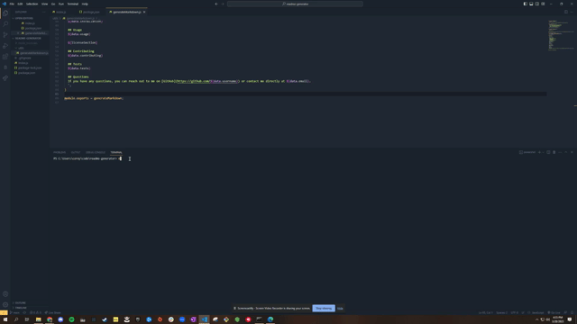

# README Generator

## Description

This application was created to generate a high-quality, professional README depending on a series of questions a user answers in their command line using Node.js.

## Table of Contents
- [Installation](#installation)
- [Usage](#usage)
- [License](#license)
- [Contributing](#contributing)
- [Tests](#tests)
- [Questions](#questions)

## Installation
The user should clone the repository from GitHub and download Node. This application also requires a file system and inquirer module.

## Usage
To use this application, please follow the steps below:
1. Clone the repository from GitHub
2. Download and install Node.js from the official website
3. Open your terminal and navigate to the root directory of the application
4. Install the required dependencies by running `npm install`
5. Start the application by running `node index.js`
6. Answer the questions that appear in your terminal
7. Once all questions have been answered, your README file will be generated.

For a more detailed explanation of how to use this application, please refer to the [video tutorial](https://drive.google.com/file/d/1tFkYqE2ltQhfwItZXlViL2RBW9OUwZkV/view).

## License

This project is licensed under the MIT license. Click [here](https://opensource.org/licenses/MIT) for more information.

## Contributing
Contributors should read the installation section.

## Tests
To run tests, use the command `npm test`.

## Questions
If you have any questions, you can reach out to me on [GitHub](https://github.com/spamdalfz) or contact me directly at coreyvasser@gmail.com.
